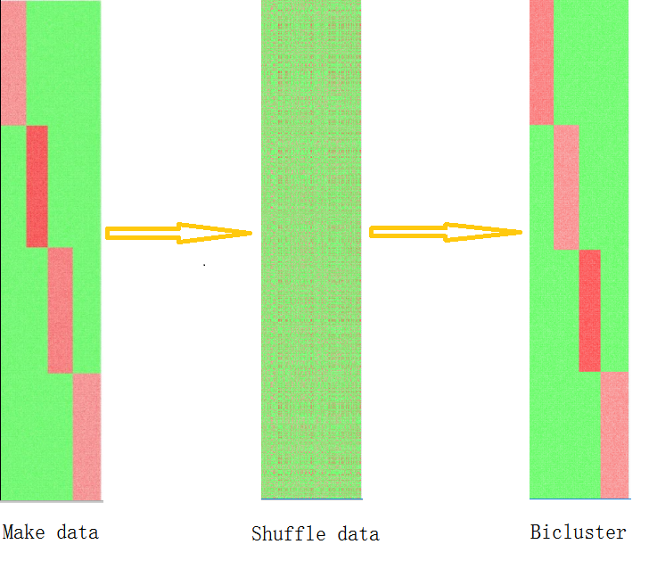
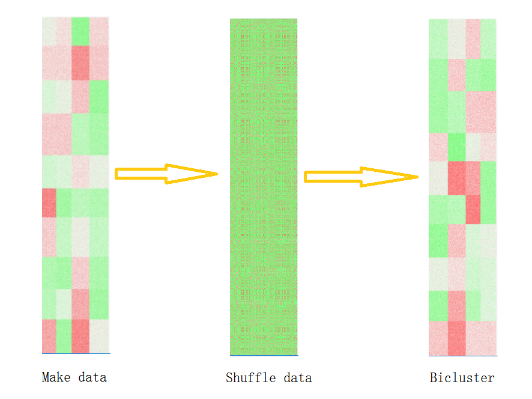
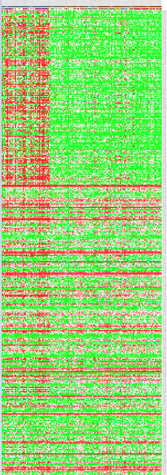
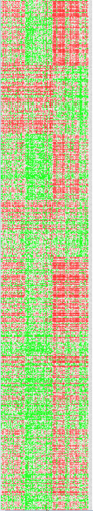

 <h1 align="center">
  A demo of the  Biclustering algorithm
 </h1>

&ensp;

&ensp;

## 1.Introduction
&ensp;

（1）bicluster 不同于传统的cluster，它会根据 sample与region两个方向去聚类。

（2）bicluster的聚类结构会根据实现的算法不同而不同，下面主要利用到***Block diagonal结构与Checkerboard结构***

&ensp;

## 2.Block diagonal
&ensp;

algorithm: 

In the Block diagonal  each row and each column belongs to exactly one bicluster, then rearranging the rows and columns of the data matrix reveals the biclusters on the diagonal. Here is an example of this structure where biclusters have higher average values than the other rows and columns.

&ensp;

下面的图是对算法的效果验证：

“Make data” 是模拟生成的数据，对应的热图，数据本身已经有模块结构

“Shuffle data”是把“Make data”打乱后的数据，对应的热力图

“Bicluster” 是按照这个算法把混乱的数据做聚类后，对应的热力图

### 这说明，如果原本数据存在*Block diagonal*这种结构，我们可以根据这个算法从混乱的数据中找出来。

## 3. Checkerboard Structures
&ensp;

algorithm: 

In the checkerboard case, each row belongs to all column clusters, and each column belongs to all row clusters. Here is an example of this structure where the variance of the values within each bicluster is small。

 
&ensp;

下面的图验证与*Block diagonal*类似：

“Make data” 是模拟生成的数据，对应的热图，它每一行有4个类，每一列有10个类

“Shuffle data”是把“Make data”打乱后的数据，对应的热图

“Bicluster” 是按照*Checkerboard*算法把混乱的数据做聚类后的数据，对应的热图

&ensp;

### 这也说明，这种算法可以从混乱的数据中找出*Checkerboard*结构的数据。

&ensp;

## 4. Validation of Gene data

&ensp;

我把上面的两个算法应用到基因数据中，进行验证，具体效果如下：

&ensp;

feature(or region): row

Sample : column

&ensp;

### Block diagonal

&ensp;
### Checkerboard

